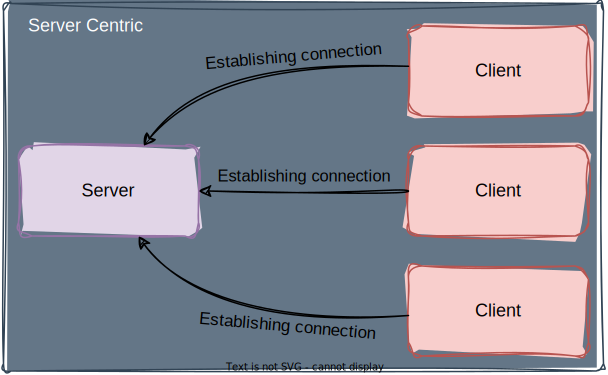
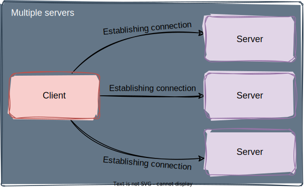
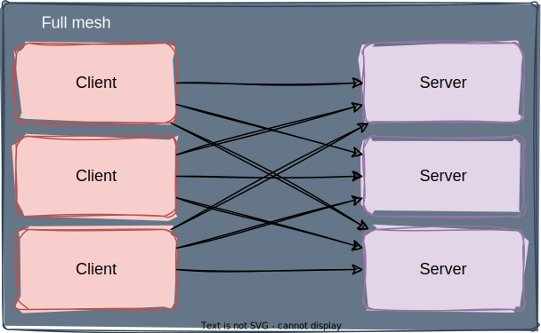

PATIO
=====

PATIO is an acronym for **P**ython **A**synchronous **T**asks for Async**IO**.

Motivation
----------

I wanted to create an easily extensible library, for distributed task execution,
like [`celery`](https://docs.celeryq.dev/), only targeting asyncio as the main
design approach.

By design, the library should be suitable for small projects and the really
large distributed projects, the general idea is the user simply split the
project code base to tasks and where those who call and perform them.
Also, this should help to your project scale horizontally. By make available
workers or callers across the network using embedded TCP, or using plugins
to communicate through the existing messaging infrastructure.

Quickstart
----------

The simplest example, which provides tasks in a thread pool:

```python
import asyncio
from functools import reduce

from patio import Registry
from patio.broker import MemoryBroker
from patio.executor import ThreadPoolExecutor


rpc = Registry()


@rpc("mul")
def multiply(*args: int) -> int:
    return reduce(lambda x, y: x * y, args)


async def main():
    async with ThreadPoolExecutor(rpc, max_workers=4) as executor:
        async with MemoryBroker(executor) as broker:
            print(
                await asyncio.gather(
                    *[broker.call("mul", 1, 2, 3) for _ in range(100)]
                )
            )


if __name__ == '__main__':
    asyncio.run(main())
```

The `ThreadPoolExecutor` in this example is the entity that will execute the
tasks. If the tasks in your project are asynchronous, you can select
`AsyncExecutor`, and then the code will look like this:

```python
import asyncio
from functools import reduce

from patio import Registry
from patio.broker import MemoryBroker
from patio.executor import AsyncExecutor


rpc = Registry()


@rpc("mul")
async def multiply(*args: int) -> int:
    # do something asynchronously
    await asyncio.sleep(0)
    return reduce(lambda x, y: x * y, args)


async def main():
    async with AsyncExecutor(rpc, max_workers=4) as executor:
        async with MemoryBroker(executor) as broker:
            print(
                await asyncio.gather(
                    *[broker.call("mul", 1, 2, 3) for _ in range(100)]
                )
            )


if __name__ == '__main__':
    asyncio.run(main())
```

For more information about what the essences are responsible for, see below.

The main concepts
-----------------

The main idea in creating this library was to create a maximally
modular and extensible system that can be expanded with third-party
integrations or directly in the user's code.

The basic elements from which everything is built are:

* `Registry` - Key-Value like store for the functions
* `Exectutor` - The thing which execute functions from the registry
* `Broker` - The actor who distribues tasks in your distributed
  (or local) system.

Registry
--------

This is a container of functions for their subsequent execution.
You can register a function by specific name or without it,
in which case the function is assigned a unique name that depends on
the source code of the function.

This registry does not necessarily have to match on the calling and called
sides, but for functions that you register without a name it is must be,
and then you should not need to pass the function name but the function
itself when you will call it.

An instance of the registry must be transferred to the broker,
the first broker in the process of setting up will block the registry
to write, that is, registering new functions will be impossible.

An optional ``project`` parameter, this is essentially like a namespace
that will help avoid clash functions in different projects with the same
name. It is recommended to specify it and the broker should also use this
parameter, so it should be the same value within the same project.

You can either manually register elements or use a
registry instance as a decorator:

```python
from patio import Registry

rpc = Registry(project="example")

# Will be registered with auto generated name
@rpc
def mul(a, b):
    return a * b

@rpc('div')
def div(a, b):
    return a / b

def pow(a, b):
    return a ** b

def sub(a, b):
    return a - b

# Register with auto generated name
rpc.register(pow)

rpc.register(sub, "sub")
```

Alternatively using ``register`` method:

```python
from patio import Registry

rpc = Registry(project="example")

def pow(a, b):
    return a ** b

def sub(a, b):
    return a - b

# Register with auto generated name
rpc.register(pow)

rpc.register(sub, "sub")
```

Finally, you can register functions explicitly, as if it were
just a dictionary:

```python
from patio import Registry

rpc = Registry(project="example")

def mul(a, b):
    return a * b

rpc['mul'] = mul
```

Executor
--------

An Executor is an entity that executes local functions from registry.
The following executors are implemented in the package:

* `AsyncExecutor` - Implements pool of asyncronous tasks
* `ThreadPoolExecutor` - Implements pool of threads
* `ProcessPoolExecutor` - Implements pool of processes
* `NullExecutor` - Implements nothing and exists just for forbid execute
  anything explicitly.

Its role is to reliably execute jobs without taking too much so as not to
cause a denial of service, or excessive memory consumption.

The executor instance is passing to the broker, it's usually applies
it to the whole registry. Therefore, you should understand what functions
the registry must contain to choose kind of an executor.

Broker
------

The basic approach for distributing tasks is to shift the responsibility
for the distribution to the user implementation. In this way, task
distribution can be implemented through third-party brokers, databases,
or something else.

This package is implemented by the following brokers:

* `MemoryBroker` - To distribute tasks within a single process.
   A very simple implementation, in case you don't know yet how
   your application will develop and just want to leave the decision
   of which broker to use for later, while laying the foundation for
   switching to another broker.
* `TCPBroker` - Simple implementation of the broker just using TCP,
   both Server and Client mode is supported for both the task executor
   and the task provider.

### `MemoryBroker`

It's useful if you don't need to assign tasks now, but it's a good help
to do it in the future.

In fact, it's a simple way to run tasks in the executor from other
places in your project.

### `TCPBroker`

This allows you to make your tasks distributed without resorting to
external message brokers or something else.

The basic idea of TCP broker implementation is that in terms of
performing tasks, there is no difference between them, it is
just a way to establish a connection, both the server and the
client can be the one who performs tasks and the one who sets
them, and it is also possible in mixed mode.

In other words, deciding who will be the server and who will be the
client in your system is just a way to connect and find each other
in your distributed system.

Here are the ways of organizing communication between the
server and the clients.

#### Server centric scheme example



This diagram describes a simple example, if there is one server
and one client exchanging messages via TCP.

#### One client multiple servers example



This is an example of how a client establishes connections to a set server.

#### Full mesh example



Full mesh scheme, all clients are connected to all servers.

#### Authorization

Authorization takes place at the start of the connection,
for this the parameter `key=` must contain the same keys for client and server.

**It is important to understand that this is not 100% protection against
attacks like MITM etc.**

This approach should only be used if the client and server are on a trusted
network. In order to secure traffic as it traverses the Internet, the
`ssl_context=` parameter should be prepended to both the server and the client.

#### Examples

The examples below will hopefully help you figure this out.

##### Server executing tasks

```python
from functools import reduce

import asyncio

from patio import Registry
from patio.broker.tcp import TCPServerBroker
from patio.executor import ThreadPoolExecutor

rpc = Registry(project="test", auto_naming=False)


def mul(*args):
    return reduce(lambda x, y: x * y, args)


async def main():
    rpc.register(mul, "mul")

    async with ThreadPoolExecutor(rpc) as executor:
        async with TCPServerBroker(executor) as broker:
            # Start IPv4 server
            await broker.listen(address='127.0.0.1')

            # Start IPv6 server
            await broker.listen(address='::1', port=12345)

            await broker.join()


if __name__ == "__main__":
    asyncio.run(main())
```

##### Client calling tasks remotely

```python
import asyncio

from patio import Registry
from patio.broker.tcp import TCPClientBroker
from patio.executor import ThreadPoolExecutor

rpc = Registry(project="test", auto_naming=False)


async def main():
    async with ThreadPoolExecutor(rpc) as executor:
        async with TCPClientBroker(executor) as broker:
            # Connect to the IPv4 address
            await broker.connect(address='127.0.0.1')

            # Connect to the IPv6 address (optional)
            await broker.connect(address='::1', port=12345)

            print(
                await asyncio.gather(*[
                    broker.call('mul', i, i) for i in range(10)
                ]),
            )


if __name__ == "__main__":
    asyncio.run(main())
```
